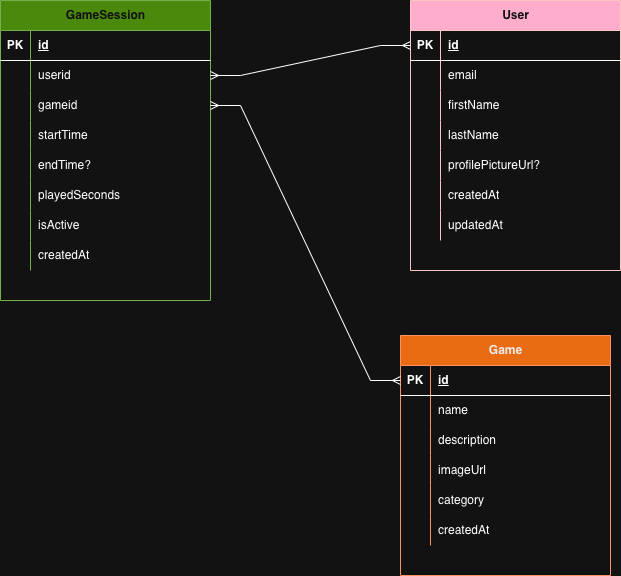

# 🎮 RetroTimer

A fullstack game session tracker built with retro arcade aesthetics. Track playtime, view statistics, and climb the leaderboard.

**What this is:** A school capstone project where I combined fullstack development, API design, and design thinking to create a functional game tracker with personality.

**Why I built it:** To practice translating design thinking into code—building something that's not just functional, but enjoyable to use.

---

## Demo

**Registration & Time Tracking**  


**User Statistics Dashboard**  


---

## 🎮Features

- **Register:** Create user profile with custom uploaded avatar
- **Select Games:** Browse retro games (Pac-Man, Space Invaders, Tetris, etc.)
- **Play:** Start sessions and track playtime with a custom-built retro timer
- **Statistics:** View personal stats, charts, and global leaderboards
- **Search Users:** Find other players and compare stats
- **Weather Widget:** Live weather updates in header
- **Retro UI:** Custom animated components built with CSS, GIFs, and dynamic divs

---

## Pages

- `/register` — User registration
- `/games` — Game selection
- `/play/:gameId` — Play a game and track time
- `/stats/:userId` — Personal and global statistics
- `/users` — User search and profiles

---

## Architecture

See the ERD below for data relationships:



**Models:**

- **User** — Profile, avatar, timestamp tracking
- **Game** — Game metadata (name, description, icon)
- **GameSession** — Links user + game + playtime, tracks session history

---

## 🛠️ Tech Stack

**Frontend:**

- React 19 + TypeScript
- Tailwind CSS (responsive design)
- Chart.js + Recharts (data visualization)
- Axios (API client)
- Vite (build tool)

**Backend:**

- Node.js + Express
- MongoDB + Mongoose (data layer)
- Winston Logger (structured logging)
- Docker (containerization)
- TypeScript (type safety)

**APIs & Integrations:**

- REST API (users, games, sessions, statistics)
- OpenWeatherMap API (live weather)
- MongoDB Aggregation Pipeline (leaderboards & statistics)

---

## Quick Start

**Prerequisites:**

- Node.js & npm
- Docker (optional, for MongoDB)

**Setup:**

```bash
# Clone
git clone https://github.com/TrooperLooper/RetroTimer.git
cd RetroTimer

# Install dependencies
npm install

# Seed initial data
npm run seed

# Start (Docker + services)
./dev.sh
```

**Open:** http://localhost:5173

**Manual Setup (without Docker):**

```bash
# Terminal 1 - Backend
cd backend && npm install && npm run dev

# Terminal 2 - Frontend
cd frontend && npm install && npm run dev
```

## Notes

**Credit:** Built with @s-weberg as a collaborative learning project.

**Next Steps:** This project was the foundation for understanding fullstack development. Future iterations could perhaps include real-time features (WebSockets), PWA capabilities, or expanded game library integration.

---

\*\*Happy playing! 🎮

- Started with wireframes, ended with pixel-perfect retro UI
- Used custom CSS animations and GIFs instead of libraries
- Built dynamic timer component from divs (no SVG)

**Fullstack Thinking**

- Frontend consumes REST API (Axios)
- Backend aggregates data for dashboards (MongoDB aggregation pipeline)
- Understood data flow: form → API → database → visualization

**Technical Skills Practiced**

- TypeScript strictness caught bugs early
- MongoDB aggregation for complex queries (leaderboards, stats)
- Component reusability (stats charts, user cards)
- Docker containerization for consistency
- Winston logging for debugging production behavior

**Real Problems**

- Handling image uploads with file validation
- Real-time data synchronization across pages
- Performance optimization for charts with large datasets

---

## 📊 Key Features Breakdown

**Custom Retro Timer**

- Digital screens & buttons built from dynamic divs + CSS animations (not a library)
- Color-coded segments for game type identification
- Smooth transitions and visual feedback

**Dashboard & Leaderboards**

- MongoDB aggregation pipeline for ranking
- Real-time stat calculations
- Multiple chart types (bar, line, pie)

**User System**

- Avatar upload with validation
- Session history per user
- Comparative statistics

---

Credits: Shared effort by @s-weberg and @TrooperLooper
